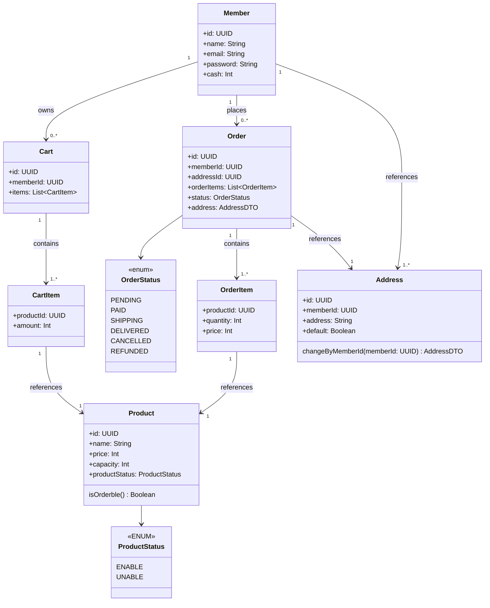

# 멀티모듈 기반 이커머스 프로젝트

## Tech Stack

- Kotlin 2.0 _(Java21)_
- Spring Boot 3.4.1
- MySQL8
- Redis Cluster
- Kafka

## module architecture

```
root-project/
└── module/
    ├── application/ # 진입점 (스프링 메인 클래스, API, 설정 인터페이스 구현 등)
    │   └── ** 
    ├── core/ # 공통 사용 모듈 (보안, 유틸, 공통클래스 등)
    │   └── ** 
    ├── domain/ # 도메인 별 비즈니스 로직
    │   └── ** 
    └── infrastructure/ # 외부 시스템 클라이언트 (DB, Redis, Kafka 등)
        └── ** 
```

### application layer

- 모든 요청의 진입점
- API 정의, 설정 구성, 각 도메인 서비스 연결

### core layer

- 공통 유틸, 보안, 인증 관련 모듈
- 여러 도메인과 application 모듈에서 공유
- 최소한의 외부의존성을 가지거나 가지지 않음

### domain layer

- 도메인 별 비즈니스 로직을 담당
- **서로 다른 도메인 모듈 간 직접 의존을 하지 않음**
- 다른 의존이 필요한 경우
  - 다른 도메인의 DTO 요청
  - 메시지 큐(Kafka)
  - Pub/Sub 패턴,
  - 인터페이스 추상화를 통한 간접 의존 방식

### infrastructure layer

- MySQL, Redis, Kafka 등 외부 시스템 연동
- 도메인 로직과는 분리되어 있음 _(application 에서 간접 의존)_

## domain modules

```
ex)

domain/
└── src/main/kotlin/
    ├── service/domain # 도메인 서비스 계층
    │   ├── Domain.kt
    │   ├── DomainService.kt
    │   └── DomainQuery.kt
    │
    ├── infrastructure/external # 서비스 구현을 위한 기술 세부사항
    │   ├── DomainJpaRepository.kt
    │   ├── DomainHttpClient.kt
    │   ├── DomainProducer.kt
    │   └── etc.../
    │
    └── interfaces/presentation # 외부 연결 계층
        ├── api/
        ├── event/
        ├── consumer/
        └── etc.../
```

## domain diagram

