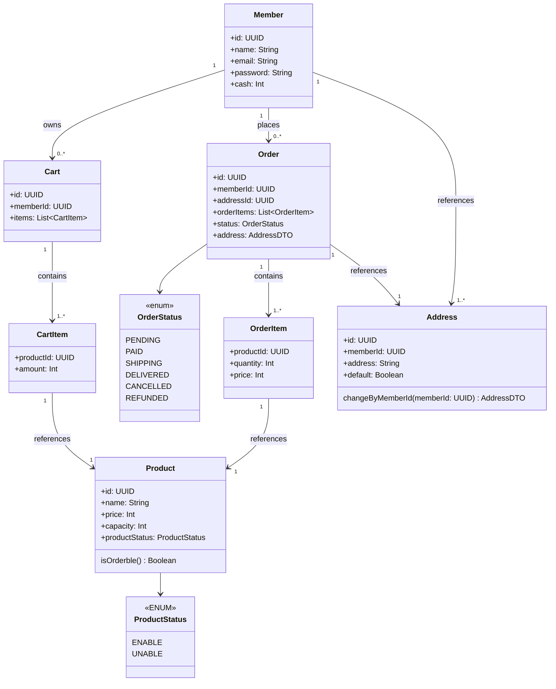

# 멀티모듈 기반 이커머스 프로젝트

## Domain

> 꼭 이 구조는 아니여도됨
> 필요하면 추가/삭제 가능

```mermaid
classDiagram
    class Member {
        +id: UUID
        +name: String
        +email: String
        +password: String
        +cash: Int
    }

    class Address {
        +id: UUID
        +memberId: UUID
        +address: String
        +default: Boolean
        changeByMemberId(memberId: UUID) AddressDTO
    }

    class Product {
        +id: UUID
        +name: String
        +price: Int
        +capacity: Int
        +productStatus: ProductStatus
        isOrderble() Boolean
    }

    class ProductStatus {
        <<ENUM>>
        ENABLE
        UNABLE
    }

    class Cart {
        +id: UUID
        +memberId: UUID
        +items: List~CartItem~
    }

    class CartItem {
        +productId: UUID
        +amount: Int
    }

    class Order {
        +id: UUID
        +memberId: UUID
        +addressId: UUID
        +orderItems: List~OrderItem~
        +status: OrderStatus
        +address: AddressDTO
    }

    class OrderItem {
        +productId: UUID
        +quantity: Int
        +price: Int
    }

    class OrderStatus {
        <<enum>>
        PENDING
        PAID
        SHIPPING
        DELIVERED
        CANCELLED
        REFUNDED
    }

    Member "1" --> "0..*" Cart: owns
    Member "1" --> "0..*" Order: places
    Member "1" --> "1..*" Address: references
    Order --> OrderStatus
    Product --> ProductStatus
    Order "1" --> "1..*" OrderItem: contains
    Order "1" --> "1" Address: references
    OrderItem "1" --> "1" Product: references
    Cart "1" --> "1..*" CartItem: contains
    CartItem "1" --> "1" Product: references


```

## 형준

### Member

### Address

## 정욱

### Product

### Inventory

## 영민

### Order

### Cart
