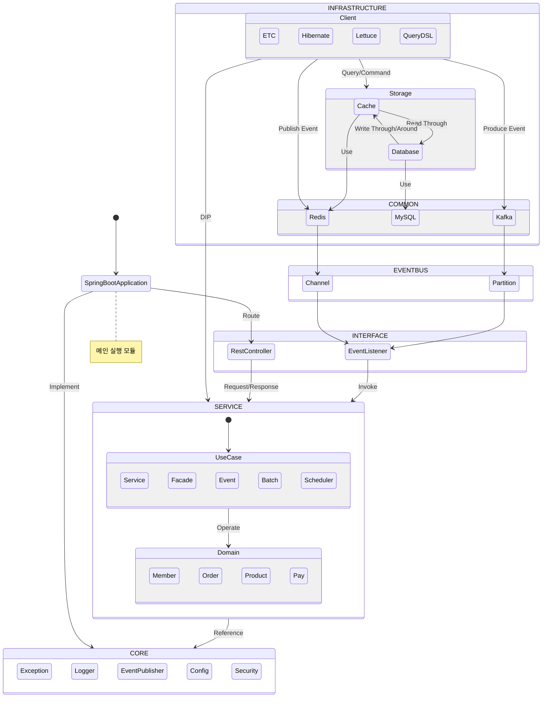
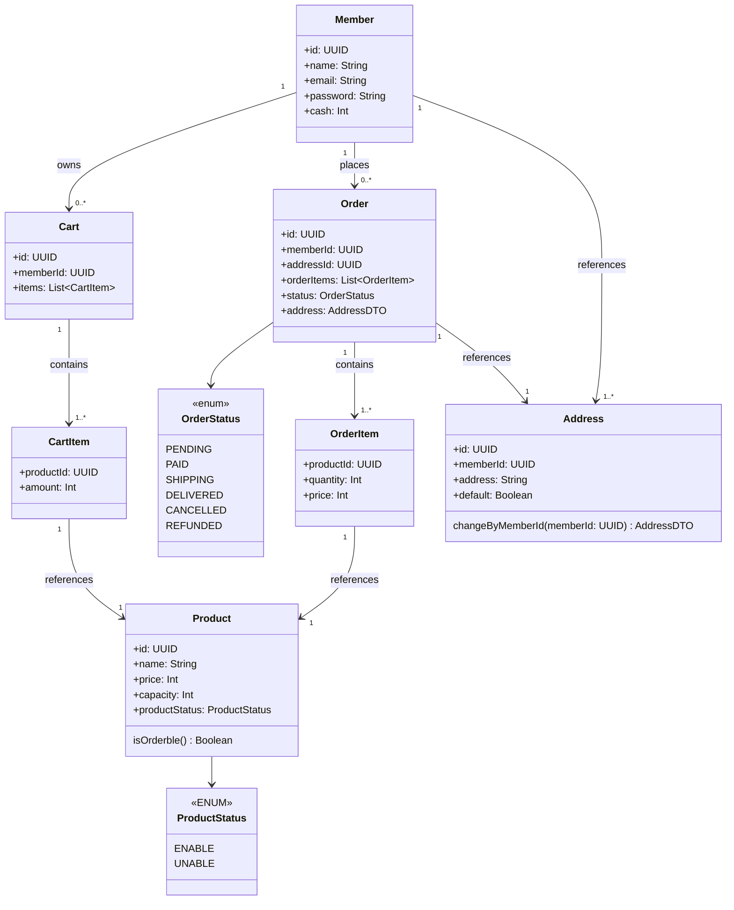

# 멀티모듈 기반 이커머스 프로젝트

## Tech Stack

- Kotlin 2.0 _(Java21)_
- Spring Boot 3.4.1
- MySQL8.4.4
- Redis Cluster
- Kafka

## Multi Module Architecture

```
project-root/
└── module/
    ├── app/
    │   └── # core 모듈의 구현, 스프링 설정 등
    │   └── Application.kt (SpringBootApplication 진입점)
    │
    ├── core/
    │   └── # 공통 의존 모듈 
    │
    ├── common/
    │   └── # 공통 사용 모듈 (레디스 클라이언트, 카프카, MySQL 등의 외부 시스템 클라이언트 구현체)
    │
    ├── domain/
    │   ├─── domain-interface
    │   │    └── 도메인 인터페이스 (RestAPI, Consumer, Subscriber 등...)
    │   │
    │   ├─── domain-service
    │   │    └── 도메인 로직 (Service, Facade, UseCase, DTO 등...)
    │   │
    │   ├─── domain-persistence
    │   │    └── 도메인 데이터 영속 (JPA, Jooq, QueryDSL, Cache, AWS S3 등...)
    │   │
    │   └─── domain-external-client
    │        └── 외부 시스템 연동 (Publisher, Producer, 외부 API 등...)
    │
    └── test/
        ├─── configuration
        │    └── 공통 테스트 설정 (Redis, Kafka, MySQL, H2 등...)
        ├─── integration
        │    └── 도메인별 통합 테스트
        └─── support
             └── 기타 테스트 공통 유틸 등
```

### Domain Dependency Flow



### Domain Model Diagram

